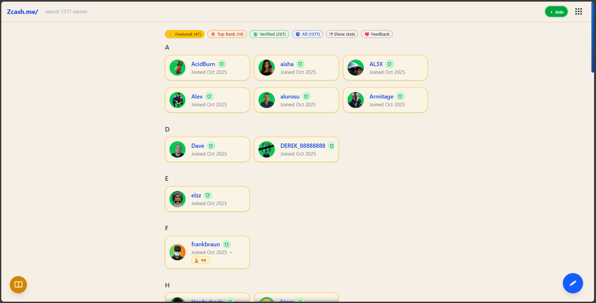

# Zcash Address Directory

# Get Started

Zcash Address Directory  is a decentralized directory and messaging layer for the Zcash ecosystem. It turns complex Zcash addresses into shareable, human-readable profile links (e.g., zcash.me/your_name).

## The Problem

Sharing Zcash addresses (u1... or zs1...) is cumbersome and error-prone. Identity verification usually requires centralized accounts or invasive sign-ups.

## The Solution

- Shareable Identity: A clean link for your Zcash address, bio, and social proofs.

- No Passwords: Authentication happens on-chain via Zcash memos.

- Verification: Proves you own the address without revealing your view keys.

## 30-Second Onboarding

1. Open Zcash.me.

2. Click + Join in the top right.

3. Enter your desired Name and Zcash Address.

4. Done. You now have a profile URL.

## Requirements

- A Zcash wallet that supports Memo fields (e.g., Zashi, YWallet, Zingo, Edge).

- A tiny amount of ZEC (approx 0.003) for verification transactions.

# User Guide

## Claim a Name

1. Navigate to the home page.



2. Click the + Join button.


3. Enter a display Name (letters, numbers, underscores).


4. Paste your Zcash Address (Unified, Sapling, or Transparent).


5. Optionally add a referrer username from from the directory if you have.


6. Optionally add social links (X, etc.).


7. Click Next. Your profile is immediately live (Unverified).

## Verify Your Profile

Verification adds a green checkmark and ranks you higher in the directory.

1. Go to your profile page.


2. Click the Verify button (or flip the card to the back and click Verify).


3. A QR code and Zcash URI will appear.


4. Scan the QR code with your wallet.

5. Send the transaction (do not alter the memo or amount).

6. Wait for the transaction. You will receive an OTP (One Time Passcode) via an incoming Zcash memo.

7. Click Enter Passcode on your profile and input the code to finalize.


## Edit Profile

1. Navigate to your profile.

2. Click the Menu (☰) button on the card or flip the card using the Edit icon.


3. Update your Bio, Avatar URL, or Links.

4. To save changes, you must Verify again (this proves you still control the address).


5. Follow the verification flow to sign the update on-chain.

## Send a Memo

1. Go to any user's profile.

2. Click the Draft (✎) button (bottom right or card action).

3. Type your message.

4. Click Open in Wallet or scan the QR code to pre-fill the transaction in your Zcash app.


# Concepts

## Zcash Address Directory  Profiles

A profile is an aggregation of off-chain metadata (name, bio) indexed by an on-chain Zcash address. While the directory is a web service, the authority to modify the profile rests entirely with the holder of the Zcash private keys.

## Resolution

- **Web**: `zcash.me/username` resolves to the profile card.

- **Search**: Users can search by name or partial address.

- **Integrity**: The service treats the Zcash blockchain as the source of truth for ownership.

## Verification Model

Verification uses a **Challenge-Response** mechanism:

1. **Challenge**: The user initiates a request. The server generates a unique payload.

2. **Response**: The user sends a Zcash transaction containing specific data in the encrypted memo field.

3. **Confirmation**: The server observes the blockchain. If the transaction matches the challenge, an OTP is sent back to the user's address via an on-chain memo. This proves the user can send and receive from that address.

## Privacy Model

- Public Data: Name, Bio, Links, and the Zcash Address listed are public.

- Shielded Verification: The verification transaction itself can be shielded. The server only needs to see the transaction effect (receipt) to confirm ownership.

- No IP Logging: The service does not map IP addresses to Zcash identities.

## Expiration & "Good Thru"

To prevent namespace squatting and ensure active addresses:

- Verified status is valid for 90 days.

- Users must re-verify (send a "heartbeat" transaction) to renew their "Good Thru" date.

- Expired profiles lose their verified badge but remain in the directory.

# Technical Reference

## Architecture

- Frontend: React 19, Vite, TailwindCSS. PWA enabled for offline caching.

- Backend: Supabase (PostgreSQL).

- Blockchain Integration: Uses a Zcash watcher node to monitor the specific "Sink" address for verification messages.

## Schema (Core Tables)

`zcasher`: Stores core identity.

- `id`: UUID

- `name`: String (Unique)

- `address`: String (Unique)

- `address_verified`: Boolean

- `last_signed_at`: Timestamp

`zcasher_links`: Stores social proofs.

- `url`, `label`, `is_verified`

## Verification Function (`confirm_otp_sql`)

A PostgreSQL RPC function that handles the logic:

1. Accepts `zcasher_id` and `otp`.

2. Checks against the `pending_verifications` table.

3. If valid and not expired:

    - Updates `zcasher.address_verified` to `true`.

    - Applies any pending profile edits (bio, links) stored in the verification metadata.

    - Updates `last_signed_at`.

## Memo Encoding

Profile updates are encoded in a compact JSON-like format within the Zcash memo field to save space:

``` json
{
  "z": "profile_id",
  "n": "New Name",
  "b": "New Bio text...",
  "l": ["+twitter.com/user", "-oldLinkID"]
}
```

- `z`: Zcasher ID (Required)

- `n`: Name update

- `b`: Bio update

- `l`: Link diff operations (+ add, - remove)

## ZIP 321 URI Structure

QR codes generate standard ZIP 321 payment URIs:
```zcash:<address>?amount=<amount>&memo=<base64_encoded_memo>```

## PWA & Offline

The app uses `vite-plugin-pwa`.

- Manifest: Cached for instant load.

- Images: Profile images are lazy-loaded and cached in browser storage.

- Behavior: The app acts as a read-only directory when offline.

---

# FAQ

## Why does my Zcash address keep changing?

Zashi uses rotating addresses. Every generated address still belongs to the same wallet because all addresses come from the same seed phrase. Rotating prevents address reuse and protects your privacy.

## Does a changing address affect my Zcash Address Directory  profile?

No. Any address you verify still points to your wallet. Zcash Address Directory  accepts whichever valid address your wallet provides.

## What does verification do?

Verification activates the user’s verifiedIds, which feeds into:

``` javascript
setVerifiedNameKeys(vNameKeys)
```

This gives your profile:

- Name protection — your username becomes officially reserved.

- Directory persistence — verified profiles stay visible longer.

- Verified links — your public links remain active instead of expiring.

## How do I renew my expiry date?

Reverify your profile and approve any link changes.
(In the future, this may use message signing.)

## Why did numbers get added to my username?

If the clean username (e.g., `trinath`) is already associated with a verified profile, the system appends numbers to avoid conflicts.

## How do I reserve my username permanently?

Verify your address.
A verified username becomes locked so others cannot use it.

## Why do I need to verify my social links?

Verified public links allow others to recognize you across platforms.
Unverified links expire along with the profile unless renewed.

## What does the “Custom Server” option in Zashi do?

It allows you to choose which lightwallet backend your wallet connects to. Our Zcash Address Directory  light wallet servers is fully operational. You can turn on the light with `light.zcash.me:443`.

- It does not boost transaction priority.
- It improves syncing reliability.
- It decentralizes node usage so wallets don’t all depend on a single provider.

More decentralized servers → more reliable wallet syncing.

## Why did my profile disappear?

Unverified profiles expire after a period of inactivity and are automatically removed.
Verify your address to keep the profile active.

## Why do addresses expire after 8 hours?

New addresses are automatically deleted after 8 hours to protect your privacy.
If you want your profile to stay visible for longer, verify it.

## Are messages stored by Zcash Address Directory ?

No. Zcash Address Directory  only builds a ZIP-321 URI.
Your wallet sends the message or memo directly on-chain.

## Does being first give me rights to a username?

Yes — if you verify.
If you claim a name before others and verify it, the clean username becomes yours.
